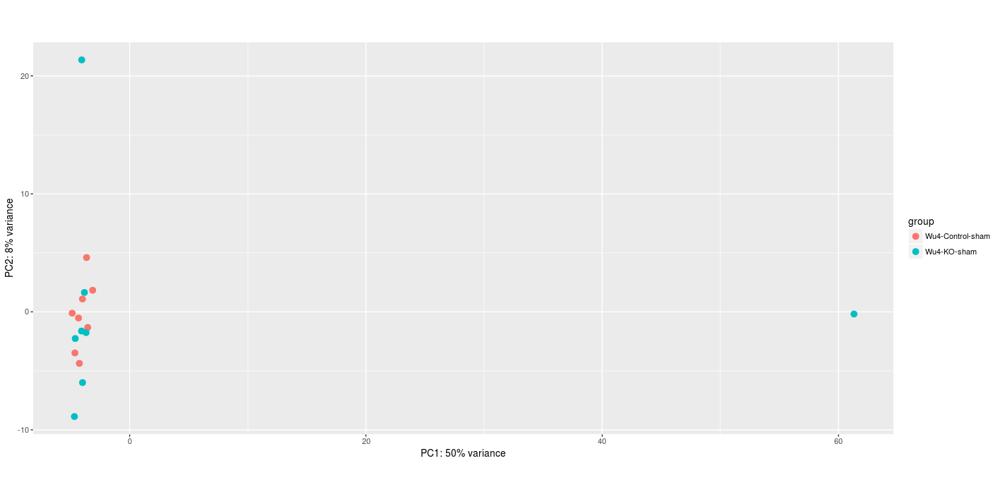

```{r setup, include=FALSE}
knitr::opts_chunk$set(echo = TRUE)
```
```{r warning=FALSE}

```

This is a Quality-check to filter out outliers.
All Graphs shown are scaled logarithmic.
We saw a signifcant variation between "p" and "t" groups.


##Hierachical clustering of all samples:
 

##Heatmap of all samples:


##PCA plot of all samples:


##PCA plot of different Genotypes:


##PCA plot of different Genotypes t cleaned:


##PCA plot of different Treatments:


##PCA plot of different Treatments t cleaned:


##PCA plot of p and t:


#PCA plot Stim:


#PCA plot Stim_saline:


#PCA plot Stim_Angiotensin:


#PCA plot TRPC:


#PCA plot TRPC_sham:


#PCA plot TRPC_TAC:


#PCA plot Wu4:


#PCA plot Wu4_Isoproterenol:


#PCA plot Wu4_saline:


#PCA plot Wu4_sham:


#PCA plot Wu4_TAC:


